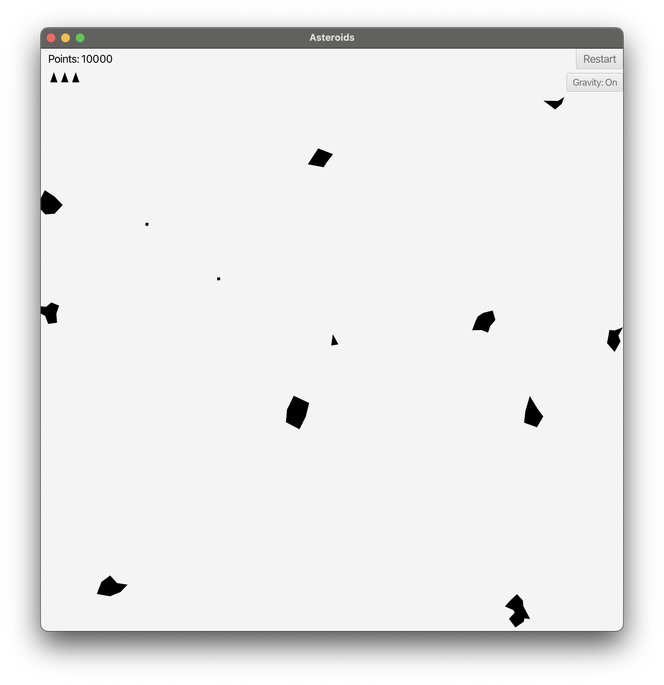

# Asteroids (Java)

A Java-based Asteroids game built to explore game loops, object movement, collision detection, and game mechanics.

## Features
- Player movement and shooting
- Asteroid spawning system
- Collision detection
- Score tracking
- 10-level progression
- Restart functionality

## Game Modes
- Classic Mode
- Gravity Mode

## Testing
- JUnit tests for core game logic
- Tested character movement, rotation, acceleration, and collisions
- Tested ship, asteroid, and projectile behaviour

## What I Learned
- Game loop architecture
- Object-oriented design in Java
- Collision detection systems
- Score and game state management
- Writing unit tests with JUnit

## Status
Core game complete.
